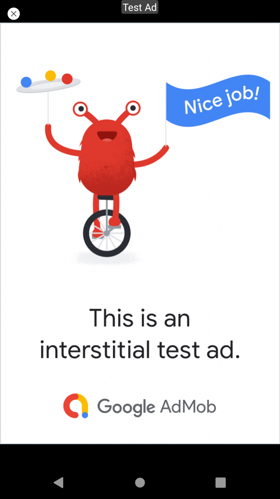

# AndReddit-Reddit_Client-Udacity_Android_Developer_Capstone_project

AndReddit is a simple Reddit client. The API library is separete, you can easily use the library in your projects. 
This is my Capstone Project for the Udacity Android Developer Nanodegree (by Google). 

IMPORTANT: Please replace the api keys inside the values/api_keys.xml file with your keys before running the application, otherwise it will not work.

This application uses:
- Reddit API
- Google ads
- firebase 

<kbd>

</kbd>

<kbd>

</kbd>

<kbd>

</kbd>

<kbd>

</kbd>

<kbd>

</kbd>

<kbd>

</kbd>

<kbd>

</kbd>

<kbd>

</kbd>

<kbd>

</kbd>
